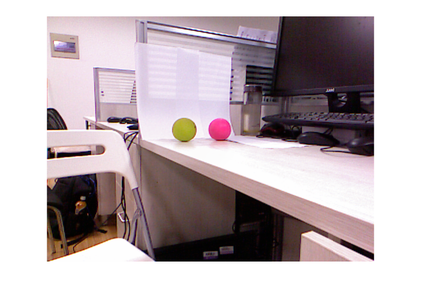
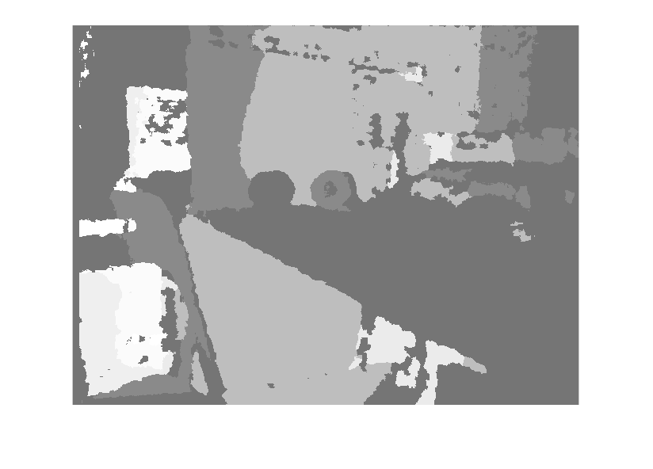
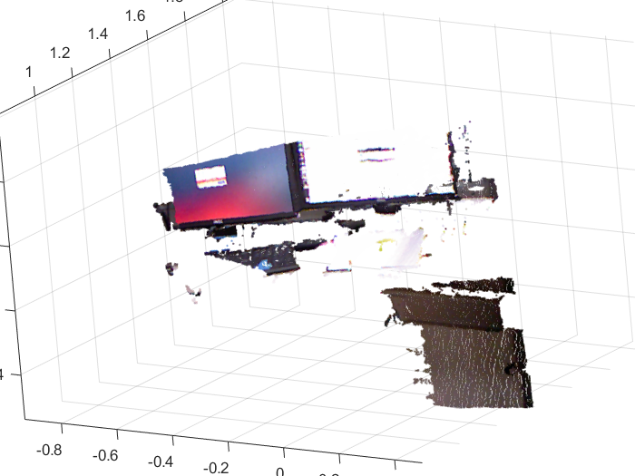
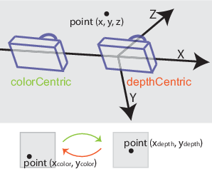

# Using the Kinect® for Windows® V1 in Matlab

This document shows how to obtain the data available from Kinect for Windows V1 sensor using Image Acquisition Toolbox.

## Kinect for Windows Sensor Components and Specifications

<div align="center">
  <p>kinect version 1 senser</p>
  
</div>

Inside the sensor case, a Kinect for Windows sensor contains:
- An RGB camera that stores three channel data in a 640x480 resolution. This makes capturing a color image possible.
- An infrared (IR) emitter and an IR depth sensor. The emitter emits infrared light beams and the depth sensor reads the IR beams reflected back to the sensor. The reflected beams are converted into depth information measuring the distance between an object and the sensor. This makes capturing a depth image possible.
- A multi-array microphone, which contains four microphones for capturing sound. Because there are four microphones, it is possible to record audio as well as find the location of the sound source and the direction of the audio wave.
- A 3-axis accelerometer configured for a 2G range, where G is the acceleration due to gravity. It is possible to use the accelerometer to determine the current orientation of the Kinect.

<div align="center">
  <p>kinect version 1 senser components</p>
  
</div>

#### Specifications for the Kinect

|Kinect | Array Specifications|
| :------------ |:---------------:|
|Color Camera  | 640 x 480 |
|Depth Camera  | 320 x 240, 640 x 480 |
|Max Depth Distance  | ~4.5 M |
|Min Depth Distance  | 40 cm in near mode |
|Horizontal Field of View  | 57 degrees |
|Vertical Field of View  | 43 degrees |
|Vertical tilt range  | 	±27° |
|Frame rate (depth and color stream) | 30 frames per second (FPS) |
|Audio format| 16-kHz, 24-bit mono pulse code modulation (PCM) |
|Audio input characteristics | A four-microphone array with 24-bit analog-to-digital converter (ADC) and Kinect-resident signal processing including acoustic echo cancellation and noise suppression |
|Accelerometer characteristics | A 2G/4G/8G accelerometer configured for the 2G range, with a 1° accuracy upper limit |
|Tilt Motor  | yes |
|Skeleton Joints Defined  | 20 joints |
|Full Skeletons Tracked  | 2 |
|USB Standard  | 2.0 |
|Supported OS  | Win 7, Win 8, Win10 |

Note: The resolution of the depth stream is dependent on the frame rate, and is specified by the DepthImageFormat Enumeration enumeration. Similarly, the resolution of the color stream is specified by the ColorImageFormat Enumeration enumeration.

## Dependece

- [Matlab](https://www.mathworks.com/) -- R2013a and later
- [Kinect for Windows SDK 1.6](https://www.microsoft.com/en-us/download/details.aspx?id=34808)
- [Image Acquisition Toolbox](https://ww2.mathworks.cn/products/imaq.html)
- [Computer Vision System Toobox](https://ww2.mathworks.cn/products/computer-vision.html) -- (optional)
- [OpenNI](http://www.openni.ru/) -- (optional)
- [MATPCL](https://ww2.mathworks.cn/matlabcentral/fileexchange/40382-matlab-to-point-cloud-library) -- (optional)

## Quick Start: Using the Kinect® for Windows® V1 from Image Acquisition Toolbox™

This example shows how to obtain the data available from Kinect for Windows V1 sensor using Image Acquisition Toolbox.

#### See What Kinect for Windows Devices and Formats are Available

The Kinect for Windows has two sensors, an color sensor and a depth sensor. To enable independent acquisition from each of these devices, they are treated as two independent devices in the Image Acquisition Toolbox. This means that separate VIDEOINPUT object needs to be created for each of the color and depth(IR) devices.
Typically, each camera or image device in the Image Acquisition Toolbox™ has one DeviceID. Because the Kinect® for Windows® camera has two separate sensors, the color sensor and the depth sensor, the toolbox lists two DeviceIDs. Use imaqhwinfo on the adaptor to display the two device IDs.

```
% The Kinect for Windows Sensor shows up as two separate devices in IMAQHWINFO.
hwInfo = imaqhwinfo('kinect')
```

    hwInfo = 
    
      包含以下字段的 struct:
    
       AdaptorDllName:    'C:\ProgramData\MATLAB\SupportPackages\R2017b\toolbox\imaq\supportpackages\kinectruntime\adaptor\win64\mwkinectimaq.dll'
    AdaptorDllVersion: '5.3 (R2017b)'
          AdaptorName: 'kinect'
            DeviceIDs: {[1]  [2]}
           DeviceInfo: [1×2 struct]
           
If you look at each device, you can see that they represent the color sensor and the depth sensor. The following shows the color sensor.

```
hwInfo.DeviceInfo(1)
```
    ans = 

      包含以下字段的 struct:

             DefaultFormat: 'RGB_640x480'
       DeviceFileSupported: 0
                DeviceName: 'Kinect Color Sensor'
                  DeviceID: 1
     VideoInputConstructor: 'videoinput('kinect', 1)'
    VideoDeviceConstructor: 'imaq.VideoDevice('kinect', 1)'
          SupportedFormats: {'Infrared_640x480'  'RGB_1280x960'  'RGB_640x480'  'RawBayer_1280x960'  'RawBayer_640x480'  'RawYUV_640x480'  'YUV_640x480'}

The following shows the depth sensor, which is Device 2.

```
hwInfo.DeviceInfo(2)
```
    ans = 

      包含以下字段的 struct:

             DefaultFormat: 'Depth_640x480'
       DeviceFileSupported: 0
                DeviceName: 'Kinect Depth Sensor'
                  DeviceID: 2
     VideoInputConstructor: 'videoinput('kinect', 2)'
    VideoDeviceConstructor: 'imaq.VideoDevice('kinect', 2)'
          SupportedFormats: {'Depth_320x240'  'Depth_640x480'  'Depth_80x60'}

#### Acquire Color and Depth Data

In order to acquire synchronized color and depth data, we must use manual triggering instead of immediate triggering. The default immediate triggering suffers from a lag between streams while performing synchronized acquisition. This is due to the overhead in starting of streams sequentially.

**Notice**: You can get the frame of the video and the frame is filled with unsigned 16bit data. Actual distance value from the camera is data millimeters.

```
% Create the VIDEOINPUT objects for the two streams
colorVid = videoinput('kinect',1)
```

    Summary of Video Input Object Using 'Kinect Color Sensor'.

    Acquisition Source(s):  Color Source is available.

    Acquisition Parameters:  'Color Source' is the current selected source.
                           10 frames per trigger using the selected source.
                           'RGB_640x480' video data to be logged upon START.
                           Grabbing first of every 1 frame(s).
                           Log data to 'memory' on trigger.

      Trigger Parameters:  1 'immediate' trigger(s) on START.

                  Status:  Waiting for START.
                           0 frames acquired since starting.
                           0 frames available for GETDATA.
                           
```
depthVid = videoinput('kinect',2)
```

    Summary of Video Input Object Using 'Kinect Depth Sensor'.

    Acquisition Source(s):  Depth Source is available.

    Acquisition Parameters:  'Depth Source' is the current selected source.
                           10 frames per trigger using the selected source.
                           'Depth_640x480' video data to be logged upon START.
                           Grabbing first of every 1 frame(s).
                           Log data to 'memory' on trigger.

      Trigger Parameters:  1 'immediate' trigger(s) on START.

                  Status:  Waiting for START.
                           0 frames acquired since starting.
                           0 frames available for GETDATA.

```
% Set the triggering mode to 'manual'
triggerconfig([colorVid depthVid],'manual');
```

Set the FramesPerTrigger property of the VIDEOINPUT objects to '1' to acquire 1 frames per trigger. 

```
colorVid.FramesPerTrigger = 1;
depthVid.FramesPerTrigger = 1;

% Start the color and depth device. This begins acquisition, but does not
% start logging of acquired data.
start([colorVid depthVid]);
```

Set the Kinect senser acquire color and depth data as manual trigger.

```
% Trigger the devices to start logging of data.
trigger([colorVid depthVid]);

% Retrieve the acquired data
[colorFrameData,colorTimeData,colorMetaData] = getdata(colorVid);
[depthFrameData,depthTimeData,depthMetaData] = getdata(depthVid);

% Stop the devices
stop([colorVid depthVid]);
```

Display the acquired data

```
figure(1)
imshow(colorFrameData)

figrue(2)
imshow(depthFrameData)
```

<table><tr>
<td>
  <p align="middle"> color image </p>
  
  </td>
<td>
  <p align="middle"> depth image </p>
  
  </td>
</tr></table>

Since depth image is uint16 type, one cannot distinguish the diffence of the grey level, so it is recommended to  re-quantization the grey level for a display convenience.

```
% Adaptive histogram equalization
H1=adapthisteq(depthFrameData);
figure(3);
imshow(H1);

% Histogram equalization
H2=histeq(depthFrameData);
figure(4);
imshow(H2);
```

<table>
<tr>
<td>
  <p align="middle"> Adaptive histogram equalization </p>
  
</td>
<td>
  <p align="middle"> Histogram equalization </p>
  
</td>
</tr>
</table>

#### Acquire Data from Kinect V1 Color and Depth Devices Simultaneously

You can synchronize the data from the Kinect® for Windows® color stream and the depth stream using software manual triggering.
This example shows the synchronization method used to manually trigger both objects.

1. Create the objects for the color and depth sensors. Device 1 is the color sensor and Device 2 is the depth sensor.

```
vid = videoinput('kinect',1);
vid2 = videoinput('kinect',2);
```

2. Get the source properties for the depth device.

```
srcDepth = getselectedsource(vid2);
```

3. Set the frames per trigger for both devices to 1.

```
vid.FramesPerTrigger = 1;
vid2.FramesPerTrigger = 1;
```

4. Set the trigger repeat for both devices to 200, in order to acquire 201 frames from both the color sensor and the depth sensor.

```
vid.TriggerRepeat = 200;
vid2.TriggerRepeat = 200;
```

5. Configure the camera for manual triggering for both sensors.

```
triggerconfig([vid vid2],'manual');
```

6. Start both video objects.

```
start([vid vid2]);
```

7. Trigger the devices, then get the acquired data.

```
% Trigger 200 times to get the frames.
for i = 1:200
    % Trigger both objects.
    trigger([vid vid2])
    % Get the acquired frames and metadata.
    [imgColor, ts_color, metaData_Color] = getdata(vid);
    [imgDepth, ts_depth, metaData_Depth] = getdata(vid2);
end
```

## Matlab Kinect Function

Acquire image data from Kinect for Windows V1, The Kinect adaptor lets you acquire images using a Kinect® for Windows® V1 or V2 device. The Kinect V1 sensor runs on Windows 7 and above.

#### Functions

|Functions | Explanation |
| :------------ |:---------------:|
|[imaqtool](https://ww2.mathworks.cn/help/imaq/imaqtool.html) | Launch Image Acquisition Tool |
|[videoinput](https://ww2.mathworks.cn/help/imaq/videoinput.html) | Create video input object |
|[imaq.VideoDevice](https://ww2.mathworks.cn/help/imaq/imaq.videodevice.html) | Acquire one frame at a time from video device |
|[getdata](https://ww2.mathworks.cn/help/imaq/getdata.html) | Acquired image frames to MATLAB workspace |
|[peekdata](https://ww2.mathworks.cn/help/imaq/peekdata.html) | Most recently acquired image data |
|[getsnapshot](https://ww2.mathworks.cn/help/imaq/getsnapshot.html) | Immediately return single image frame |
|[start](https://ww2.mathworks.cn/help/imaq/start.html) | Obtain exclusive use of image acquisition device |
|[islogging](https://ww2.mathworks.cn/help/imaq/islogging.html) | Determine whether video input object is logging |
|[isrunning](https://ww2.mathworks.cn/help/imaq/isrunning.html) | Determine whether video input object is running |
|[isvalid](https://ww2.mathworks.cn/help/imaq/isvalid.html) | Determine whether image acquisition object is associated with image acquisition device |
|[wait](https://ww2.mathworks.cn/help/imaq/wait.html) | Wait until image acquisition object stops running or logging |
|[stop](https://ww2.mathworks.cn/help/imaq/stop.html) | Stop video input object |
|[clear](https://ww2.mathworks.cn/help/imaq/clear.html) | Clear image acquisition object from MATLAB workspace |
|[delete](https://ww2.mathworks.cn/help/imaq/delete.html) | Remove image acquisition object from memory |
|[flushdata](https://ww2.mathworks.cn/help/imaq/flushdata.html) | Remove data from memory buffer used to store acquired image frames |
|[obj2mfile](https://ww2.mathworks.cn/help/imaq/obj2mfile.html) | Convert video input objects to MATLAB code |
|[imaqmontage](https://ww2.mathworks.cn/help/imaq/imaqmontage.html) | Sequence of image frames as montage |
|[load](https://ww2.mathworks.cn/help/imaq/load.html) | Load image acquisition object into MATLAB workspace |
|[save](https://ww2.mathworks.cn/help/imaq/save.html) | Save image acquisition objects to MAT-file |
|[trigger](https://ww2.mathworks.cn/help/imaq/trigger.html) | Initiate data logging |
|[triggerconfig](https://ww2.mathworks.cn/help/imaq/triggerconfig.html) | Configure video input object trigger properties |
|[triggerinfo](https://ww2.mathworks.cn/help/imaq/triggerinfo.html) | Provide information about available trigger configurations |

#### Color sensor device-specific properties

|Device-Specific Property – Color Sensor | Description |
| :------------ |:---------------:|
|Accelerometer | Returns 3-D vector of acceleration data for both the color and depth sensors. The data is updated while the device is running or previewing. This 1 x 3 double represents the x, y, and z values of acceleration in gravity units g (9.81m/s^2). For example,[0.06 -1.00 -0.09] represents values of x as 0.06 g, y as -1.00 g, and z as -0.09 g. |
|AutoExposure | Use to set the exposure automatically. This control whether other related properties are activated. Values are on (default) and off. on means that exposure is set automatically, and these properties are not able to be set and will throw a warning: FrameInterval, ExposureTime, and Gain. off means that these properties are not able to be set and will throw a warning: PowerLineFrequency, BacklightCompensation, and Brightness. |
|AutoWhiteBalance | Use to enable or disable automatic white balance setting. on (default) means that it will automatically configure white balance and the WhiteBalance property cannot be set. off means that the WhiteBalance property is settable.|
|BacklightCompensation | Configures backlight compensation modes to adjust the camera to capture images dependent on environmental conditions.Note that this property is only valid if AutoExposure is set to Enabled. The default is AverageBrightness. Values are: AverageBrightness favors an average brightness level CenterPriority favors the center of the scene LowLightsPriority favors a low light level CenterOnly favors the center only |
|Brightness | Indicates the brightness level. The value range is 0.0 to 1.0, and the default value is 0.2156. Note that this property is only valid if AutoExposure is set to Enabled. |
|CameraElevationAngle | Controls the angle of the sensor lens. This is the camera angle relative to the ground. The value must be an integer property with range of -27 to 27 degrees. The default value is the last set value, since this is a sticky setting. Only set it if you want to change the angle of the camera. This property is shared with the depth sensor also. |
|Contrast | Indicates contrast level. Values must be in the range 0.5 to 2, with a default value of 1. |
|ExposureTime | Indicates the exposure time in increments of 1/10,000 of a second. The value range is 0 to 4000, and the default is 0. Note that this property is only valid if AutoExposure is set to Disabled. |
|FrameInterval | Indicates the frame interval in units of 1/10,000 of a second. The value range is 0 to 4000, and the default is 0. Note that this property is only valid if AutoExposure is set to Disabled. |
|FrameRate | Frames per second for the acquisition. This property is read only and the possible values for the color sensor are 12, 15, and 30 (default). It reflects the actual frame rate when running. |
|Gain | Indicates a multiplier for the RGB color values. The value range is 1.0 to 16.0, and the default is 1.0. Note that this property is only valid if AutoExposure is set to Disabled. |
|Gamma | Indicates gamma measurement. Values must be in the range 1 to 2.8, with a default value of 2.2. |
|Hue | Indicates hue setting. Values must be in the range -22 to 22, with a default value of 0. |
|PowerLineFrequency | 	Option for reducing flicker caused by the frequency of a power line. Values are Disabled, FiftyHertz, and SixtyHertz. The default is Disabled. Note that this property is only valid if AutoExposure is set to Enabled. |
|Saturation | Indicates saturation level. Values must be in the range 0 to 2, with a default value of 1. |
|Sharpness | Indicates sharpness level. Values must be in the range 0 to 1, with a default value of 0.5. |
|WhiteBalance | Indicates color temperature in degrees Kelvin. The value range is 2700 to 6500 and the default is 2700. Note that this property is only valid if AutoWhiteBalance is set to Disabled. |

#### Depth sensor device-specific properties
|Device-Specific Property – Depth Sensor | Description |
| :------------ |:---------------:|
|Accelerometer | 	Returns 3-D vector of acceleration data for both the color and depth sensors. The data is updated while the device is running or previewing. This 1 x 3 double represents the x, y, and z values of acceleration in gravity units g (9.81m/s^2). For example, [0.06 -1.00 -0.09] represents values of x as 0.06 g, y as -1.00 g, and z as -0.09 g. |
|BodyPosture | Indicates whether the tracked skeletons are standing or sitting. Values are Standing (gives 20 point skeleton data) and Seated (gives 10 point skeleton data, using joint indices 2 - 11). Standing is the default. Note that if BodyPosture is set to Seated mode, and TrackingMode is set to Position, no position is returned, since Position is the location of the hip joint and the hip joint is not tracked in Seated mode. See the subsection “BodyPosture Joint Indices” at the end of this example for the list of indices of the 20 skeletal joints. |
|CameraElevationAngle | Controls the angle of the sensor lens. This is the camera angle relative to the ground. The value must be an integer property with range of -27 to 27 degrees. The default value is the last set value, since this is a sticky setting. Only set it if you want to change the angle of the camera. This property is shared with the color sensor also. |
|DepthMode | Indicates the range of depth in the depth map. Values are Default (range of 50 to 400 cm) and Near (range of 40 to 300 cm).|
|FrameRate | Frames per second for the acquisition. This property is read only and is fixed at 30 for the depth sensor for all formats. It reflects the actual frame rate when running. |
|IREmitter | 	Controls whether the IR emitter is on or off. Values are on and off. Initially, the default value is on. However, this is a sticky property, so the default value is the last set value. If you set it to off, it will remain off in future uses until you change the setting. An advantage of this property is that it is useful when using multiple Kinect devices to avoid interference. |
|SkeletonsToTrack | Indicates the Skeleton Tracking ID returned as part of the metadata. Values are: [] Default tracking [TrackingID1] Track 1 skeleton with Tracking ID = TrackingID1 [TrackingID1 TrackingID2] Track 2 skeletons with Tracking IDs = TrackingID1 and TrackingID2 |
|TrackingMode	| Indicates tracking state. Values are: Skeleton tracks full skeleton with joints Position tracks hip joint position only Off disables skeleton position tracking (default) Note that if BodyPosture is set to Seated mode, and TrackingMode is set to Position, no position is returned, since Position is the location of the hip joint and the hip joint is not tracked in Seated mode. |

## (Optional) MATLAB to Point Cloud Library

matpcl is pure MATLAB code that allows interfacing with the Point Cloud Library (PCL) tools by reading and writing PCD format files. Being pure MATLAB avoids all kinds of headaches in trying to link PCL code into MEX files which involves various grief such as versions of compilers and support libraries such as boost.

There are only four user-level functions:

|MATPCL functions | Description |
| :------------ |:---------------:|
|savepcd | writes a matrix as an optionally coloured point cloud in an ASCII PCD format file. |
|loadpcd | reads an optionally colored point cloud from a PCD format file (ASCII or binary) and returns a matrix. |
|pclviewer | writes a matrix to a temporary file and invokes the pcl_viewer app for visualization. This is much much faster for rotating a large point cloud than using a MATLAB 3D plot. |
|lscpd | shows the attributes of the PCD files in the current directory |

Point clouds are considered to be either: </br>
- 2-d matrices, with one column per point. The rows are X, Y, Z and for a colored point cloud X, Y, Z, R, G, B. (R,G,B) are in the range 0 to 1. </br>
- 3-d matrices, with planes X, Y, Z and for a colored point cloud X, Y, Z, R, G, B. (R,G,B) are in the range 0 to 1. </br>

Limitations : </br>
No support for reading/writing normals </br>

#### Syntax

```
ptCloud = pcfromkinect(depthDevice,depthImage)
ptCloud = pcfromkinect(depthDevice,depthImage,colorImage)
ptCloud = pcfromkinect(depthDevice,depthImage,colorImage,alignment)
```

#### Description

**ptCloud = pcfromkinect(depthDevice,depthImage)** returns a point cloud from a Kinect® depth image. The depthDevice input can be either a videoinput object or an imaq.VideoDevice object configured for Kinect (Versions 1 and 2) for Windows®.This function requires the Image Acquisition Toolbox™ software, which supports Kinect for Windows.

**ptCloud = pcfromkinect(depthDevice,depthImage,colorImage)** adds color to the returned point cloud, specified by the colorImage input.
The Kinect for Windows system, designed for gaming, produces depthImage and colorImage as mirror images of the scene. The returned point cloud is corrected to match the actual scene.

**ptCloud = pcfromkinect(depthDevice,depthImage,colorImage,alignment)** additionally returns the color point cloud with the origin specified at the center of the depth camera.

### Examples

#### Plot Color Point Cloud from Kinect for Windows

Plot a color point cloud from Kinect images. This example requires the Image Acquisition Toolbox software and the Kinect camera and a connection to the camera.

Create a System object™ for the color device.

```
colorDevice = imaq.VideoDevice('kinect',1)
```

Create a System object for the depth device.

```
depthDevice = imaq.VideoDevice('kinect',2)
```

Initialize the camera.

```
step(colorDevice);
step(depthDevice);
```

Load one frame from the device.

```
colorImage = step(colorDevice);
depthImage = step(depthDevice);
```

Extract the point cloud.

```
ptCloud = pcfromkinect(depthDevice,depthImage,colorImage);
```

Initialize a point cloud player to visualize 3-D point cloud data. The axis is set appropriately to visualize the point cloud from Kinect.

```
player = pcplayer(ptCloud.XLimits,ptCloud.YLimits,ptCloud.ZLimits,...
	'VerticalAxis','y','VerticalAxisDir','down');

xlabel(player.Axes,'X (m)');
ylabel(player.Axes,'Y (m)');
zlabel(player.Axes,'Z (m)');
```

Acquire and view 500 frames of live Kinect point cloud data.

```
for i = 1:500    
   colorImage = step(colorDevice);  
   depthImage = step(depthDevice);
 
   ptCloud = pcfromkinect(depthDevice,depthImage,colorImage);
 
   view(player,ptCloud);
end
```

Output:

<div align="center">
  <p>pcfromkinect output</p>
  
</div>

Release the objects.

```
release(colorDevice);
release(depthDevice);
```

#### Input Arguments

**depthDevice — Input video object** (videoinput object | imaq.VideoDevice object) : </br>
Input video object, specified as either a videoinput object or an imaq.VideoDevice object configured for Kinect for Windows.

**depthImage — Depth image** (M-by-N matrix) : </br>
Depth image, specified as an M-by-N pixel matrix. The original images, depthImage and colorImage, from Kinect are mirror images of the scene.

The Kinect depth camera has limited range. The limited range of the Kinect depth camera can cause pixel values in the depth image to not have corresponding 3-D coordinates. These missing pixel values are set to NaN in the Location property of the returned point cloud.

Data Types: uint16

**colorImage — Color image** (M-by-N-by-3 RGB truecolor image) : </br>
Color image, specified as an M-by-N-by-3 RGB truecolor image that the Kinect returns. The original images, depthImage and colorImage, from Kinect are mirror images of the scene.

Data Types: uint8

**alignment — Direction of the image coordinate system** ('colorCentric' (default) | 'depthCentric') : </br>
Direction of the image coordinate system, specified as the character vector 'colorCentric' or 'depthCentric'. Set this value to 'colorCentric' to align depthImage with colorImage. Set alignment to 'depthCentric' to align colorImage with depthImage.

The origin of a right-handed world coordinate system is at the center of the depth camera. The x-axis of the coordinate system points to the right, the y-axis points downward, and the z-axis points from the camera.

<div align="center">
  
</div>

#### Output Arguments

**ptCloud — Point cloud** (pointCloud object) : </br>
Point cloud, returned as a pointCloud object. The origin of the coordinate system of the returned point cloud is at the center of the depth camera.

