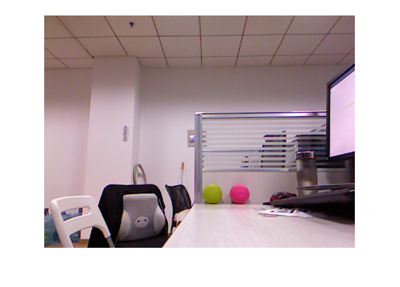

# Using the Kinect® for Windows® V1 in Matlab

This document shows how to obtain the data available from Kinect for Windows V1 sensor using Image Acquisition Toolbox.

## Kinect for Windows Sensor Components and Specifications

<div align="center">
  <p>kinect version 1 senser</p>
  
</div>

Inside the sensor case, a Kinect for Windows sensor contains:
- An RGB camera that stores three channel data in a 640x480 resolution. This makes capturing a color image possible.
- An infrared (IR) emitter and an IR depth sensor. The emitter emits infrared light beams and the depth sensor reads the IR beams reflected back to the sensor. The reflected beams are converted into depth information measuring the distance between an object and the sensor. This makes capturing a depth image possible.
- A multi-array microphone, which contains four microphones for capturing sound. Because there are four microphones, it is possible to record audio as well as find the location of the sound source and the direction of the audio wave.
- A 3-axis accelerometer configured for a 2G range, where G is the acceleration due to gravity. It is possible to use the accelerometer to determine the current orientation of the Kinect.

<div align="center">
  <p>kinect version 1 senser components</p>
  
</div>

#### Specifications for the Kinect

|Kinect | Array Specifications|
| :------------ |:---------------:|
|Color Camera  | 640 x 480 |
|Depth Camera  | 320 x 240 |
|Max Depth Distance  | ~4.5 M |
|Min Depth Distance  | 40 cm in near mode |
|Horizontal Field of View  | 57 degrees |
|Vertical Field of View  | 43 degrees |
|Vertical tilt range  | 	±27° |
|Frame rate (depth and color stream) | 30 frames per second (FPS) |
|Audio format| 16-kHz, 24-bit mono pulse code modulation (PCM) |
|Audio input characteristics | A four-microphone array with 24-bit analog-to-digital converter (ADC) and Kinect-resident signal processing including acoustic echo cancellation and noise suppression |
|Accelerometer characteristics | A 2G/4G/8G accelerometer configured for the 2G range, with a 1° accuracy upper limit |
|Tilt Motor  | yes |
|Skeleton Joints Defined  | 20 joints |
|Full Skeletons Tracked  | 2 |
|USB Standard  | 2.0 |
|Supported OS  | Win 7, Win 8, Win10 |

Note: The resolution of the depth stream is dependent on the frame rate, and is specified by the DepthImageFormat Enumeration enumeration. Similarly, the resolution of the color stream is specified by the ColorImageFormat Enumeration enumeration.

## Dependece

- [Matlab](https://www.mathworks.com/) -- R2013a and later
- [Kinect for Windows SDK 1.6](https://www.microsoft.com/en-us/download/details.aspx?id=34808)
- [Image Acquisition Toolbox](https://ww2.mathworks.cn/products/imaq.html)
- [Computer Vision System Toobox](https://ww2.mathworks.cn/products/computer-vision.html) -- (optional)
- [OpenNI](http://www.openni.ru/) -- (optional)

## Quick Start: Using the Kinect® for Windows® V1 from Image Acquisition Toolbox™

This example shows how to obtain the data available from Kinect for Windows V1 sensor using Image Acquisition Toolbox.

#### See What Kinect for Windows Devices and Formats are Available

The Kinect for Windows has two sensors, an color sensor and a depth sensor. To enable independent acquisition from each of these devices, they are treated as two independent devices in the Image Acquisition Toolbox. This means that separate VIDEOINPUT object needs to be created for each of the color and depth(IR) devices.

```
% The Kinect for Windows Sensor shows up as two separate devices in IMAQHWINFO.
hwInfo = imaqhwinfo('kinect')
```

    hwInfo = 
    
      包含以下字段的 struct:
    
       AdaptorDllName:    'C:\ProgramData\MATLAB\SupportPackages\R2017b\toolbox\imaq\supportpackages\kinectruntime\adaptor\win64\mwkinectimaq.dll'
    AdaptorDllVersion: '5.3 (R2017b)'
          AdaptorName: 'kinect'
            DeviceIDs: {[1]  [2]}
           DeviceInfo: [1×2 struct]
           
```
hwInfo.DeviceInfo(1)
```
    ans = 

      包含以下字段的 struct:

             DefaultFormat: 'RGB_640x480'
       DeviceFileSupported: 0
                DeviceName: 'Kinect Color Sensor'
                  DeviceID: 1
     VideoInputConstructor: 'videoinput('kinect', 1)'
    VideoDeviceConstructor: 'imaq.VideoDevice('kinect', 1)'
          SupportedFormats: {'Infrared_640x480'  'RGB_1280x960'  'RGB_640x480'  'RawBayer_1280x960'  'RawBayer_640x480'  'RawYUV_640x480'  'YUV_640x480'}

```
hwInfo.DeviceInfo(2)
```
    ans = 

      包含以下字段的 struct:

             DefaultFormat: 'Depth_640x480'
       DeviceFileSupported: 0
                DeviceName: 'Kinect Depth Sensor'
                  DeviceID: 2
     VideoInputConstructor: 'videoinput('kinect', 2)'
    VideoDeviceConstructor: 'imaq.VideoDevice('kinect', 2)'
          SupportedFormats: {'Depth_320x240'  'Depth_640x480'  'Depth_80x60'}

#### Acquire Color and Depth Data

In order to acquire synchronized color and depth data, we must use manual triggering instead of immediate triggering. The default immediate triggering suffers from a lag between streams while performing synchronized acquisition. This is due to the overhead in starting of streams sequentially.

```
% Create the VIDEOINPUT objects for the two streams
colorVid = videoinput('kinect',1)
```

    Summary of Video Input Object Using 'Kinect Color Sensor'.

    Acquisition Source(s):  Color Source is available.

    Acquisition Parameters:  'Color Source' is the current selected source.
                           10 frames per trigger using the selected source.
                           'RGB_640x480' video data to be logged upon START.
                           Grabbing first of every 1 frame(s).
                           Log data to 'memory' on trigger.

      Trigger Parameters:  1 'immediate' trigger(s) on START.

                  Status:  Waiting for START.
                           0 frames acquired since starting.
                           0 frames available for GETDATA.
                           
```
depthVid = videoinput('kinect',2)
```

    Summary of Video Input Object Using 'Kinect Depth Sensor'.

    Acquisition Source(s):  Depth Source is available.

    Acquisition Parameters:  'Depth Source' is the current selected source.
                           10 frames per trigger using the selected source.
                           'Depth_640x480' video data to be logged upon START.
                           Grabbing first of every 1 frame(s).
                           Log data to 'memory' on trigger.

      Trigger Parameters:  1 'immediate' trigger(s) on START.

                  Status:  Waiting for START.
                           0 frames acquired since starting.
                           0 frames available for GETDATA.

```
% Set the triggering mode to 'manual'
triggerconfig([colorVid depthVid],'manual');
```

Set the FramesPerTrigger property of the VIDEOINPUT objects to '1' to acquire 1 frames per trigger. 

```
colorVid.FramesPerTrigger = 1;
depthVid.FramesPerTrigger = 1;

% Start the color and depth device. This begins acquisition, but does not
% start logging of acquired data.
start([colorVid depthVid]);
```

Set the Kinect senser acquire color and depth data as manual trigger.

```
% Trigger the devices to start logging of data.
trigger([colorVid depthVid]);

% Retrieve the acquired data
[colorFrameData,colorTimeData,colorMetaData] = getdata(colorVid);
[depthFrameData,depthTimeData,depthMetaData] = getdata(depthVid);

% Stop the devices
stop([colorVid depthVid]);
```

Display the acquired data

```
figure(1)
imshow(colorFrameData)

figrue(2)
imshow(depthFrameData)
```

<table><tr>
<td>
  <p align="center">color</p>
  
  </td>
<td>
  <p align="center">depth</p>
  
  </td>
</tr></table>
