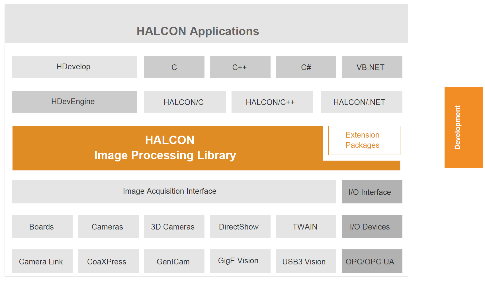

# HALCON

> "HALCON defines the state of the art in machine vision software. It provides a comprehensive vision library and is always based on the latest and most advanced technology. Whatever your task, HALCON will solve it, fast and with highest accuracy."

#### HALCON’s operators and data structures.

#### **Halcon Parameters and Data Structures:**

1. Image: 
2. Regions
3. XLDs - XLD is the abbreviation for eXtended Line Description and comprises all contour and polygon based data.
4. Handles
5. Tuple Mode

 

